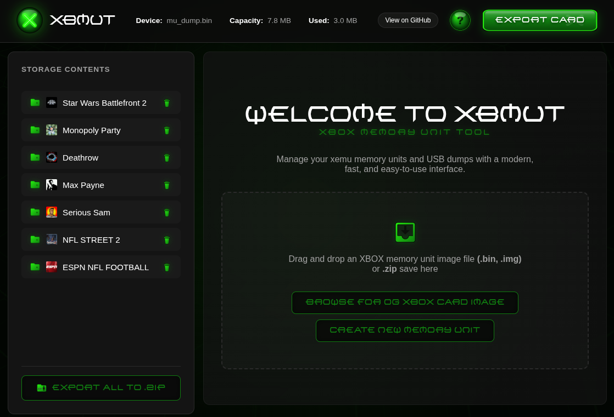
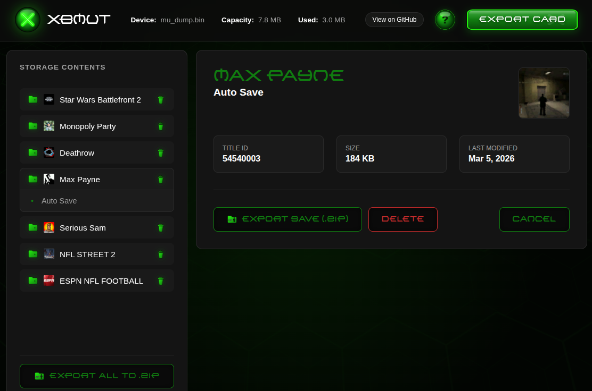

# XBMUT Web Interface

Use it here: https://BAD-AL.github.io/xbmut_web/

Web front-end for project: https://github.com/BAD-AL/xbox_memory_unit_tool 


This project is a single-page, web application built with Dart that provides a user-friendly interface for the Xbox Memory Unit Tool (`xbmut`). It allows users to manage their XEMU memory card files (`.bin, .img`) and import/export save data (`.zip`) directly from their browser.



## Features

*   **Load Memory Unit:** Drag and drop `.bin` files or use the browse button to load your XEMU memory card.
*   **Import Saves:** Drag and drop `.zip` files containing saves directly onto the application to import them into the loaded memory unit.
*   **Browse Contents:** View the contents of the memory unit, including games and individual saves, in a hierarchical tree structure.
*   **View Save Details:** Click on a save to see its title ID, size, and last modified date.
*   **Delete Saves/Games:** Remove unwanted saves or entire game data from the memory unit.
*   **Export Card:** Save the entire modified memory unit as a `.bin` file.
*   **Export Save:** Export individual saves as `.zip` files.
*   **Create New Memory Unit:** Initialize a new, blank 8MB memory unit directly in the browser.
*   **Modern UI:** A visually appealing, single-page interface inspired by the XEMU dashboard aesthetic.

## Build and Run

### Prerequisites
*   Dart SDK installed.

### Building the Application

1.  Navigate to the project directory:
    ```bash
    cd xbmut_web
    ```
2.  Fetch dependencies:
    ```bash
    dart pub get
    ```
3.  Build the web application:
    ```bash
    webdev build
    ```
    This command will compile the Dart code into JavaScript, generating the necessary files in the `web/` directory (specifically `main.dart.js`).

### Running the Application (development)

After building, you can serve the `web/` directory using any static file server. For example, using `web_http_server`.

1.  Build and serve 
    ```bash
    webdev serve 
    ```
2.  Open your browser and navigate to `http://localhost:8080`.

## Dependencies

This project utilizes the following key libraries:
*   `package:web`: For DOM manipulation and browser APIs.
*   `package:xbox_memory_unit_tool`: The Dart library for handling Xbox Memory Unit files.

---
*Project managed with Gemini CLI.*
