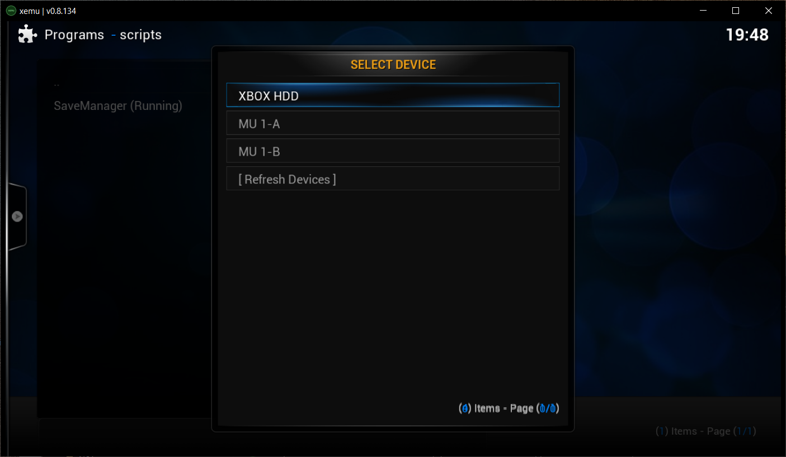
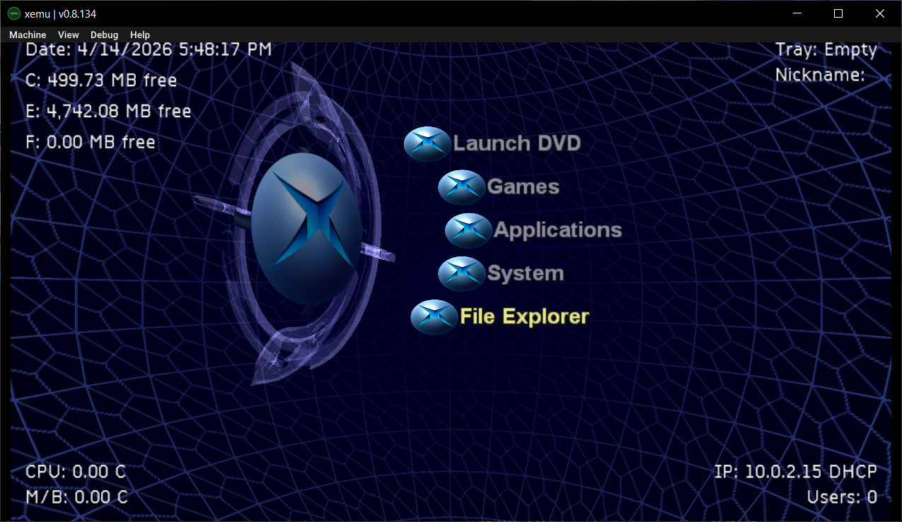
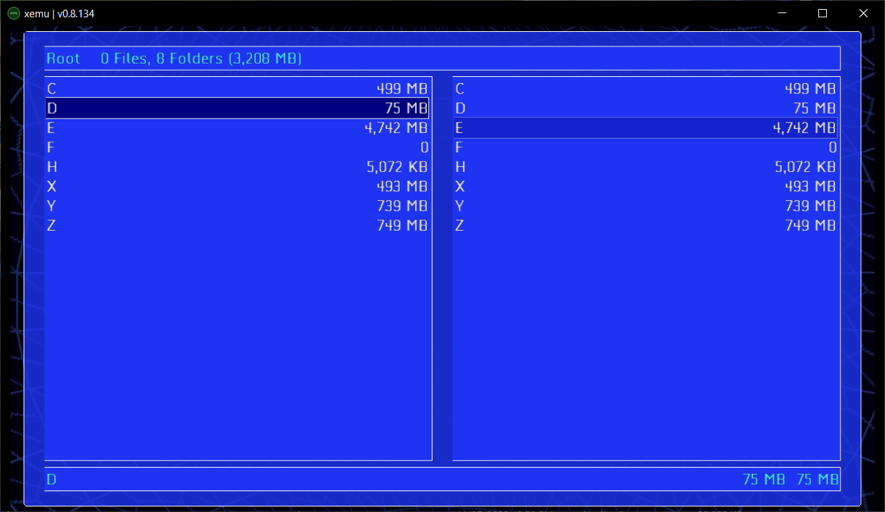
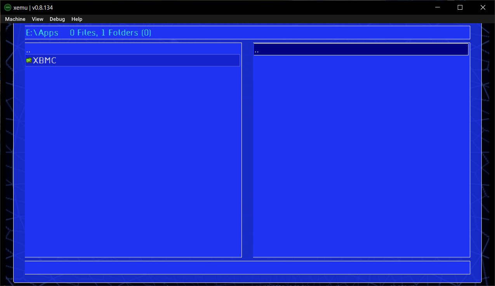
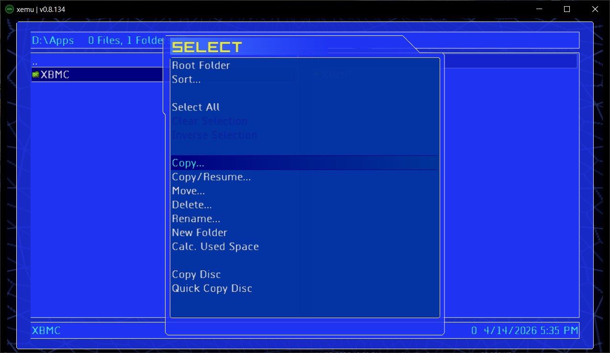
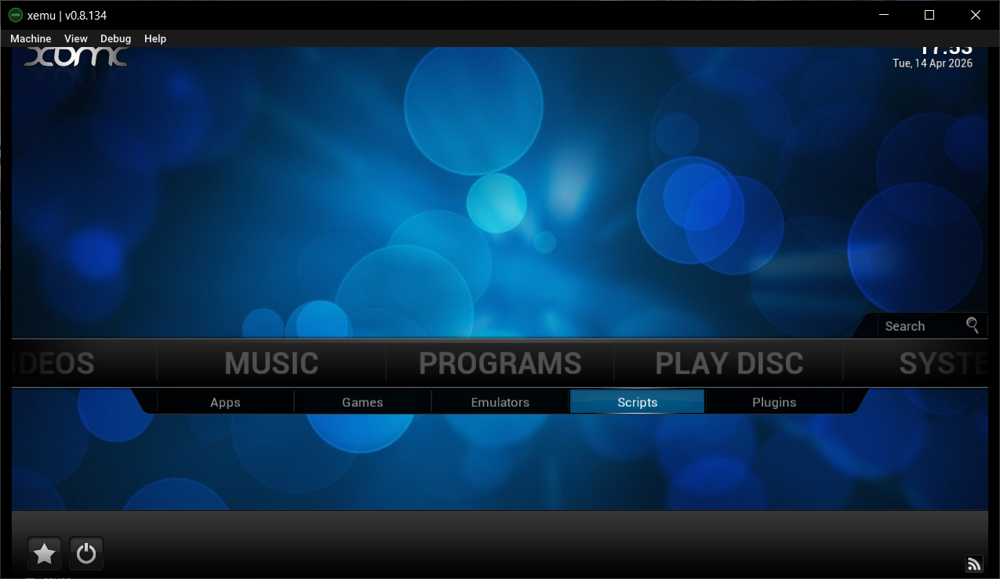
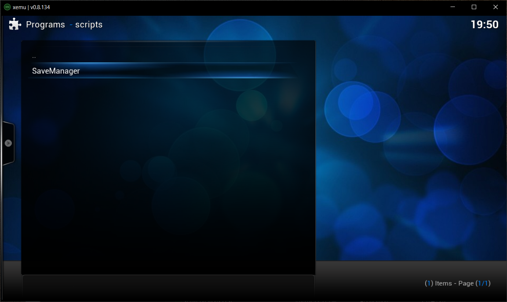
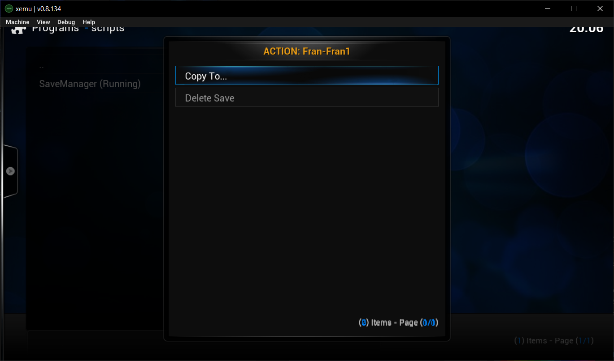
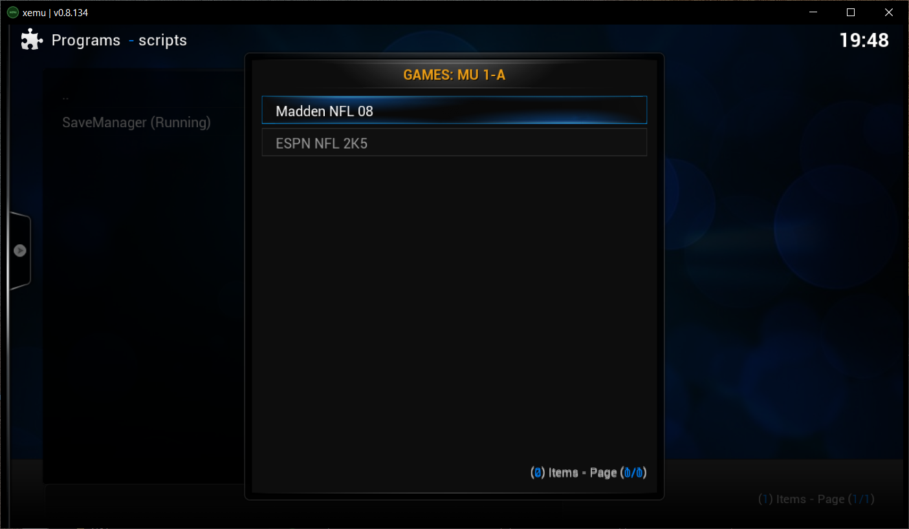
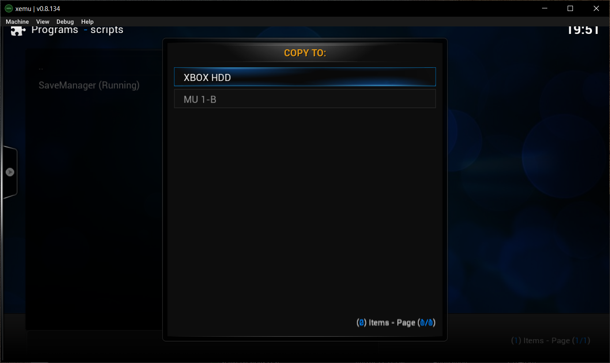

## Simple Save Manager (No FTP required) 

---
#### Info:
The Simple Save manager is a XBMC 'script' that allows the user to more easily
copy and delete game save files to/from the XBOX memory cards and the XBOX HDD.

The UnleashX.iso file is a small image that includes a functional version of UnleashX and 'XBMC4XBOX' at location '/D/Apps/XBMC/'.

---

#### Instructions 
copy Files [1 time]:
1. Boot the included ['UnleashX.iso'](UnleashX-savMgr.iso.7z) in XEMU. 
1. Use the UnleashX File browser and copy the '/D/Apps/XBMC/' folder (on the iso) to your 'Apps' folder on the XEMU HDD (usually '/E/Apps/XBMC/ ).
(Note: if you already have XBMC installed on your HDD, you only need to copy the'/D/Apps/XBMC/scripts/SaveManager/' folder to '/E/Apps/XBMC/scripts/').

Run Simple Save Manager:
1. Run XBMC 
    - Either by 'Applications -> XBMC' 
    - or use File browser and run '/E/Apps/XBMC/default.xbe'
2. Choose Porgrams -> Scripts -> Save Manager   
3. Select memory location (HDD / memory unit) 
4. Choose copy/delete operations.

##### Notes on navigating the UnleashX File Manager:
 - On XEMU, you may need to enter/exit the File Manager a few times for all folders to show up.
 - The 'select' button exits File Manager.
 - Left/Right Triggers shift highlight to the Left/Right sides of the screen.
 - Press 'A' to enter folder, 'B' to go back one folder.
 - Press 'start' to bring up context menu (for copy/delete operations).
 - The 'Copy' operation copies files/folders to the location on the other side of the screen.

#### Links:
| Description      | Link |
| ----------- | ----------- |
| XBMUT (Manage OG XBOX memory units)  | https://bad-al.github.io/xbmut_web/    |
| XEMU Xbox Emulator   | https://xemu.app/        |
| Minimal UnleashX  | https://www.youtube.com/watch?v=IHfgVmM67c4 |
|XBMC4XBOX (v3.5.3) |https://digiex.net/threads/xbmc4xbox-v3-5-3-download.14655/|

#### Credits:
- UnleashX (V0.39.0528 Build 584) - Lantus 
- XBMC4XBOX (v3.5.3) - Team XBMC, BuZz, 
- SaveManager - Gemini

